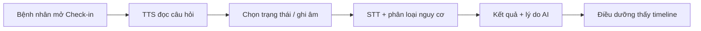

# Kiểm thử CareVoice AI

Hướng dẫn test tự động và checklist thủ công cho demo hackathon / BGK.

## Yêu cầu môi trường

| Thành phần | Phiên bản |
|------------|-----------|
| Python | 3.12+ |
| macOS + Xcode | 15+ (iOS 15+) |
| Docker | 24+ (tuỳ chọn) |
| curl, bash | có sẵn trên macOS |

## Quick test tự động

```bash
# Terminal 1 — khởi động API
make setup
make backend

# Terminal 2 — chạy toàn bộ kiểm tra (pytest + flow × 3)
make demo-check
```

Hoặc từng bước:

```bash
make test           # pytest
make smoke          # flow đầy đủ: auth, OCR, check-in, hotline, RBAC
make patient-flow   # luồng bệnh nhân OTP → check-in → hotline → logout
```

### Script chi tiết

| Script | Mô tả |
|--------|-------|
| `backend/scripts/smoke_test_localhost.sh` | Flow chính end-to-end qua curl |
| `backend/scripts/patient_flow_test.sh` | Luồng bệnh nhân + RBAC + refresh token |
| `scripts/run_submission_checks.sh` | Gộp pytest + 2 script trên × 3 lần |
| `backend/scripts/production_ocr_test.sh` | OCR nhiều đơn thuốc mẫu |
| `backend/scripts/vnpt_live_check.py` | Smoke VNPT (khi `VENDOR_MOCK_MODE=false`) |

## Tài khoản demo

| Vai trò | Đăng nhập | Ghi chú |
|---------|-----------|---------|
| Điều dưỡng | `nurse` / `nurse` | Dashboard, OCR, timeline |
| Bệnh nhân | `patient` / `patient` | Check-in, hotline |
| Bệnh nhân (OTP) | `VC-2026-000001` + OTP `123456` | SĐT `+84327628468` |

Bệnh nhân chính: **Chu Minh Tâm** (`pat_001`). Chi tiết: [docs/SETUP_AND_ACCOUNTS.md](docs/SETUP_AND_ACCOUNTS.md).

## Flow demo chính (AI end-to-end)

Luồng khuyến nghị khi pitch — thể hiện rõ AI giải quyết vấn đề gì:



1. **Check-in giọng nói** — TTS đọc câu hỏi → bệnh nhân trả lời → STT + phân loại nguy cơ → badge + lý do.
2. **Hotline AI** — Hỏi bằng chữ/giọng → SmartBot trả lời an toàn, có transcript.
3. **OCR đơn thuốc** (điều dưỡng) — Upload `backend/test/ocr/don_thuoc_chu_minh_tam.docx` → SmartReader → xác nhận thuốc.

Dữ liệu mẫu: `backend/test/ocr/`, `backend/test/stt/STT.sample.wav`.

## Checklist test thủ công

Đánh dấu trước khi nộp / demo:

### Input đúng

- [ ] Đăng nhập điều dưỡng `nurse`/`nurse` thành công
- [ ] Đăng nhập bệnh nhân `patient`/`patient` thành công
- [ ] Check-in hôm nay: chọn quick answer → nhận kết quả nguy cơ
- [ ] Hotline text: nhận câu trả lời trong vài giây
- [ ] Dashboard điều dưỡng: thấy bệnh nhân ưu tiên sau check-in

### Input sai / edge case

- [ ] Sai mật khẩu → thông báo lỗi rõ (không crash)
- [ ] OTP sai → báo lỗi, không đăng nhập
- [ ] Upload file > 25MB → HTTP 413 / thông báo file quá lớn
- [ ] Bệnh nhân gọi API staff → 403

### Mạng / API

- [ ] Tắt backend → app hiện lỗi kết nối, có nút thử lại
- [ ] Bật lại backend → thử lại thành công
- [ ] Loading spinner khi poll job OCR/check-in
- [ ] Log backend hiện `request_completed` / `request_failed` (không lộ token)

### AI output an toàn

- [ ] Câu trả lời hotline không khuyên ngừng thuốc đột ngột
- [ ] Phân loại nguy cơ có **lý do** (không chỉ badge màu)
- [ ] Không log token JWT / VNPT / CCCD trong console Xcode

### Ổn định demo

- [ ] Chạy flow chính **3 lần liên tiếp** không crash (`make demo-check`)
- [ ] Test trên thiết bị demo thật (Simulator hoặc iPhone + IP LAN)
- [ ] Quay video / chụp ảnh màn hình làm bằng chứng (tuỳ BTC)

## Test API chính (curl)

```bash
BASE=http://127.0.0.1:8000/api/v1

# Health
curl -s http://127.0.0.1:8000/healthz

# Staff login
curl -s -X POST "$BASE/auth/staff/login" \
  -H "Content-Type: application/json" \
  -d '{"login":"nurse","password":"nurse","device_id":"manual-test"}'

# Patient login
curl -s -X POST "$BASE/auth/patient/login" \
  -H "Content-Type: application/json" \
  -d '{"login":"patient","password":"patient","device_id":"manual-test"}'
```

OpenAPI đầy đủ: `http://127.0.0.1:8000/api/v1/docs`

## Chế độ mock vs VNPT live

| Mục đích | `VENDOR_MOCK_MODE` | Credential |
|----------|-------------------|------------|
| Demo nhanh / CI | `true` | Không cần |
| Pitch có AI VNPT thật | `false` | Điền trong `backend/.env` |

Kiểm tra VNPT:

```bash
cd backend
python scripts/vnpt_live_check.py
python scripts/vnpt_sample_wav_demo.py
```

## Lỗi thường gặp

| Triệu chứng | Cách xử lý |
|-------------|------------|
| Port 8000 bận | `docker compose down` hoặc `PORT=8001 make backend` |
| iPhone không kết nối | Dùng IP LAN Mac, tắt Demo mode iOS |
| OCR/check-in kẹt | Xoá `backend/*.db`, restart API |
| VNPT 401/403 | Kiểm tra `.env`, chạy `vnpt_live_check.py` |