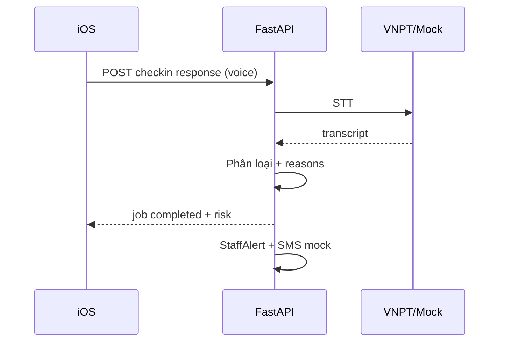

# Tính năng & luồng sử dụng

Mô tả đầy đủ tính năng CareVoice AI theo vai trò **bệnh nhân** và **điều dưỡng**. Cập nhật theo codebase thực tế.

---

## 1. Tài khoản & chế độ chạy

### Backend thật (khuyến nghị pitch)

- Base URL: `http://<IP-Mac>:8000/api/v1`
- iOS: tắt **Demo mode** → **Kết nối backend**
- Chi tiết: [SETUP_AND_ACCOUNTS.md](SETUP_AND_ACCOUNTS.md)

| Vai trò | Đăng nhập |
|---------|-----------|
| Điều dưỡng | `nurse` / `nurse` |
| Bệnh nhân | `patient` / `patient` hoặc `VC-2026-000001` + last4 `8468` |

**Bệnh nhân chính:** Chu Minh Tâm — SĐT `0327628468` — Người nhà Trần Minh Anh `+84987654321`

### Demo mode (iOS, không cần backend)

Bật trong **Cài đặt** → dữ liệu in-memory qua `DemoAPIService`. Dùng khi không có mạng backend.

---

## 2. Bệnh nhân — 5 tab

| Tab | Màn hình | Mục đích |
|-----|----------|----------|
| Trang chủ | `PatientHomeView` | Buổi sáng 2 bước, preview check-in/thuốc/tái khám |
| Lịch sử | `CheckinHistoryView` | Các lần check-in trước |
| Thuốc | `MedicationListView` | Danh sách thuốc, nhắc uống, adherence |
| Hotline | `HotlineView` | Hỏi đáp AI (chữ + giọng) |
| Cài đặt | `SettingsView` | Demo mode, backend, thông báo |

### Buổi sáng 2 bước

1. Uống thuốc (xác nhận)  
2. Lời khuyên sức khỏe hôm nay

Mở app buổi sáng → giọng chào + hướng dẫn (`SpeechReminderService`).

### Check-in hàng ngày

| Bước | Hành động | Phản hồi |
|------|-----------|----------|
| 1 | Mở Check-in hôm nay | Nghe câu hỏi TTS hoặc đọc chữ lớn |
| 2 | Chọn **Ổn / Bình thường / Có vấn đề** (bắt buộc) | Một chạm đủ để gửi |
| 3 | Tùy chọn ghi âm mô tả thêm | STT → chữ có thể sửa |
| 4 | Gửi | Polling job phân tích |
| 5 | Kết quả | Badge nguy cơ + **lý do** + gợi ý phân tích giọng + nghe lại |
| 6 | Điều dưỡng | Timeline có **audio gốc** + transcript + gợi ý phân tích + trạng thái BN chọn |
| 7 | Cần chú ý | Rung + banner người nhà (từ `caregiver_alert_sent_at` API) |

**Offline:** Queue upload khi mất mạng (`OfflineUploadQueue`).

### Thuốc & adherence

- Lịch nhắc local theo slot sáng/trưa/chiều/tối
- Thông báo deep-link mở tab Thuốc → màn xác nhận liều (`PatientNavigationCoordinator`)
- Đọc to tên thuốc khi xác nhận
- Dashboard điều dưỡng thấy liều bỏ quên

### Hotline AI

| Bước | Mô tả |
|------|-------|
| Text | Gõ câu hỏi → SmartBot sync → kết quả ngay |
| Voice | Ghi âm → dừng → **xác nhận Gửi** → STT → SmartBot → poll nếu async |
| UI | Transcript + badge nguy cơ + lý do + câu trả lời |
| Offline | Queue giọng nói; xóa bản ghi sau khi lưu offline thành công |

Từ khóa nguy hiểm (`đau ngực`, `khó thở`…) → `intervention` + alert điều dưỡng.

---

## 3. Điều dưỡng

### Dashboard (`StaffDashboardView`)

- KPI: BN active, cần chú ý, cần can thiệp, phút tiết kiệm, tỷ lệ check-in, OCR chờ, phân tích chờ
- Lọc **chỉ ca cần xử lý** (`actionable_only=true` trên API)
- Danh sách ưu tiên + tìm kiếm
- Auto-refresh ~10 giây
- Banner + âm thanh khi alert **attention/intervention** mới

### Chi tiết bệnh nhân (`PatientDetailView`)

- Timeline: check-in, hotline, OCR — kèm audio, transcript, risk, lý do, **gợi ý phân tích giọng**
- Phát lại audio gốc của bệnh nhân trên timeline
- Gọi 1 chạm BN / người nhà; đánh dấu **đã gọi lại** (`called_back`)
- Cập nhật trạng thái xử lý (handling)
- Banner SMS người nhà nếu đã gửi

### OCR đơn thuốc

1. Upload PDF / ảnh / **docx** (`DocumentPickerView`)
2. Poll job OCR → `needs_review`
3. `OCRReviewView` — chỉnh BN, thuốc, tái khám, dặn dò
4. `confirm_ocr` → lưu hồ sơ

File mẫu: `backend/test/ocr/don_thuoc_chu_minh_tam.docx`

### Tạo bệnh nhân mới

`NewPatientView` — validate tên/SĐT; mã `VC-YYYY-NNNNNN` do server sinh.

---

## 4. Backend — luồng AI

| Endpoint | AI |
|----------|-----|
| Check-in voice | STT + rule/keyword risk |
| Hotline | STT + SmartBot/guardrail |
| OCR | SmartReader / mock parser |
| Check-in question | TTS (VNPT hoặc cache) |

---

## 5. Thông báo & âm thanh

- **Bệnh nhân:** Local reminder check-in/thuốc/tái khám — **không** sound khi chỉ nhắc thường
- **Điều dưỡng:** Sound + haptic khi alert critical mới
- **SMS người nhà:** Log `sms_mock` khi risk ≥ attention và có SĐT người nhà

Chi tiết: [FREE_NOTIFICATIONS.md](FREE_NOTIFICATIONS.md)

---

## 6. Kiểm thử & demo kỹ thuật

| Tài nguyên | Đường dẫn |
|------------|-----------|
| WAV STT | `backend/test/stt/STT.sample.wav` |
| Đơn thuốc OCR | `backend/test/ocr/don_thuoc_chu_minh_tam.docx` |
| Script VNPT | `backend/scripts/vnpt_sample_wav_demo.py` |
| Pytest | `cd backend && python -m pytest -q` |

---

## 7. Chưa có trong bản demo (production sau)

| Hạng mục | Ghi chú |
|----------|---------|
| SMS gateway thật | Trigger + log đã có |
| APNs server push | Local notification đủ demo |
| Alembic / S3 / Redis queue | README backend |

---

## 8. Tài liệu liên quan

- [SYSTEM_OVERVIEW.md](SYSTEM_OVERVIEW.md)
- [PRODUCT_PITCH_SOLO.md](PRODUCT_PITCH_SOLO.md)
- [API_CONTRACT.md](API_CONTRACT.md)
- [backend/README.md](../backend/README.md)