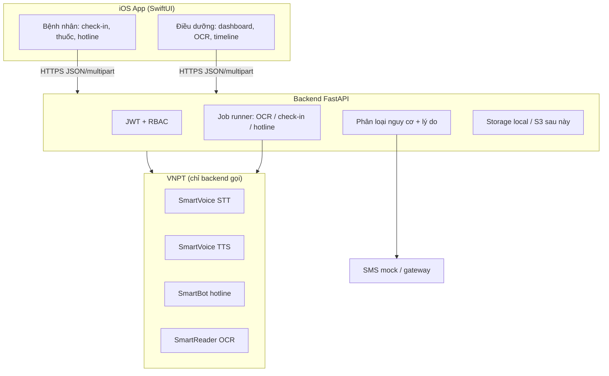

# Tổng quan hệ thống CareVoice AI

CareVoice AI là nền tảng **voice-first** hỗ trợ bệnh nhân mạn tính tại nhà và giúp điều dưỡng ưu tiên can thiệp đúng người, đúng lúc.

## Triết lý thiết kế

| Đối tượng | Nhu cầu | Giải pháp |
|-----------|---------|------------|
| Bệnh nhân cao tuổi | Ít thao tác, chữ to, không rành smartphone | Tiếng Việt, nút lớn, **đọc giọng** câu hỏi/kết quả |
| Người nhà | Biết sớm khi có dấu hiệu bất thường | Trigger SMS mock (production: SMS gateway) |
| Điều dưỡng | Ưu tiên đúng BN, gọi nhanh | Dashboard + **lý do phân loại** minh bạch |

**Nguyên tắc:** Voice-first cho bệnh nhân — Explainable AI cho điều dưỡng — Một arc buổi sáng (check-in → thuốc → tái khám).

## Kiến trúc tổng thể

**Quan trọng:** iOS **không** giữ token VNPT. Mọi STT/TTS/OCR/SmartBot đi qua backend.

## Thành phần chính

### iOS (`CareVoiceAI/`)

- **SwiftUI** + MVVM, design system thống nhất (`DesignSystem.swift`, `WowExperienceComponents.swift`)
- `APIClient` — REST + upload; `DemoAPIService` khi bật demo mode
- Dịch vụ: `SpeechReminderService` (TTS on-device), `NotificationManager` (local), `OfflineUploadQueue`
- Phân quyền: `SessionManager` + `RootView` route theo role

### Backend (`backend/app/`)

| Lớp | Vai trò |
|-----|---------|
| `api/v1/routes/` | REST endpoints theo `API_CONTRACT.md` |
| `services/` | Nghiệp vụ: check-in, hotline, OCR, staff, auth |
| `integrations/vnpt/` | Mock + live gateway (SmartReader, SmartVoice, SmartBot) |
| `services/job_runner.py` | Xử lý nền khi `VENDOR_MOCK_MODE=false` |
| `models/` | SQLAlchemy entities + enum chuẩn |

### Phân loại nguy cơ

Ba mức thống nhất toàn hệ thống:

- `normal` — bình thường
- `attention` — cần chú ý
- `intervention` — cần can thiệp

Mỗi lần phân loại kèm `reasons[]` (explainable) — hiển thị trên app bệnh nhân và timeline điều dưỡng.

## Luồng dữ liệu tiêu biểu

### Check-in buổi sáng

1. BN mở app → `GET /me/checkins/today` (có thể kèm TTS câu hỏi)
2. BN chọn nút nhanh hoặc ghi âm → `POST /checkins/{id}/responses` → `202` + `job_id`
3. Backend: STT (nếu voice) → phân loại từ khóa + quick answer → `risk_level` + `reasons`
4. Nếu attention/intervention → `StaffAlert` + log SMS người nhà
5. App poll `GET /checkin_jobs/{job_id}` → hiển thị badge + lý do + banner người nhà

### Hotline AI

1. BN gõ text hoặc ghi âm → `POST /hotline/questions`
2. Voice: STT → SmartBot/guardrail → `transcript`, `risk_level`, `reasons`, `answer_text`
3. UI card **Kết quả phân tích** trên `HotlineView`

### OCR đơn thuốc (điều dưỡng)

1. Upload PDF/ảnh/docx → job OCR → `needs_review`
2. Điều dưỡng chỉnh draft BN/thuốc/tái khám → `confirm_ocr`
3. Medication + appointment sync vào hồ sơ BN

## Công nghệ

| Thành phần | Stack |
|------------|-------|
| iOS | Swift 5, SwiftUI, iOS 15+ |
| Backend | FastAPI, Pydantic v2, SQLAlchemy 2 async |
| DB demo | SQLite; production: PostgreSQL |
| AI vendor | VNPT SmartVoice, SmartBot, SmartReader (mock/live) |
| Thông báo | Local notification (không bắt buộc APNs) |

## Trạng thái production

| Đã sẵn sàng demo | Chưa production |
|------------------|-----------------|
| Full API + iOS flows | SMS gateway thật |
| Mock + live VNPT gateway | eKYC VNPT live |
| Idempotency, rate limit | Alembic migration, S3 |
| 27+ pytest | APNs server push |
| Script VNPT WAV demo | Redis job queue |

Chi tiết chức năng: [FEATURES_AND_FLOWS.md](FEATURES_AND_FLOWS.md)  
Chạy thử: [SETUP_AND_ACCOUNTS.md](SETUP_AND_ACCOUNTS.md)